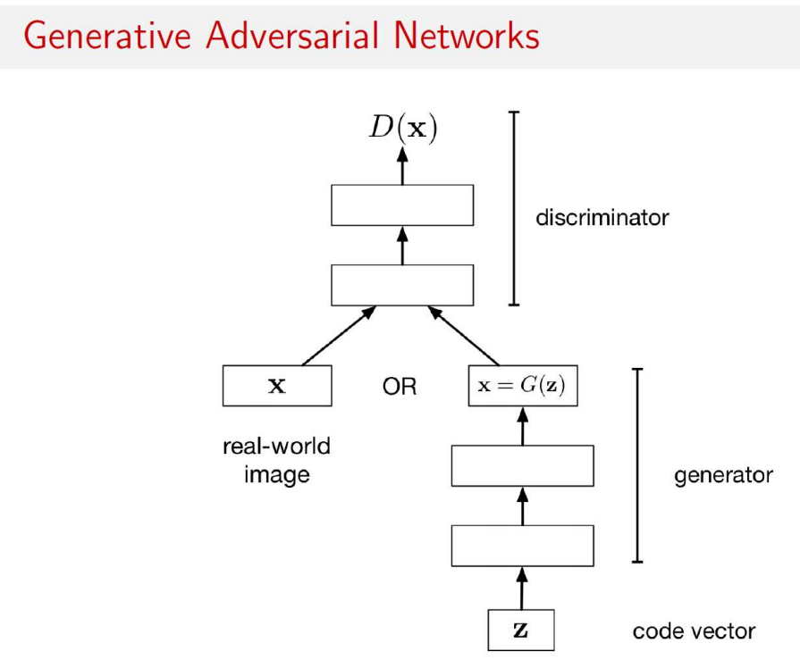
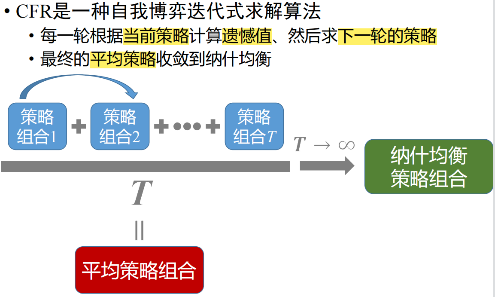

## 人工智能算法跟数据的交互

我将举3个例子，说明博弈论在人工智能算法跟数据的交互的作用。

根据博弈的对象参与者，可分为算法和算法的博弈（GAN），算法和数据的博弈（CFR、随机算法）。我熟悉的在线算法也可以看作是算法和未来数据的博弈。

我和一些同学说了一下这个题目，他们第一反应是这个题目有点奇怪，我觉得原因可能是“人工智能就是从数据中学习到一个算法”的观点；而这也是机器学习理论的研究内容：给定数据集，分析根据学习算法得到的模型和理想模型之间的差异，当然也包括了需要多少样本才能得到比较好的模型。这里的模型指的就是最终的人工智能算法（比如训练好的SVM、神经网络等）。这个研究难度极大，我不熟但正在学（我导师以前是做这方面的）且和博弈论关系似乎不大。

关于以ChatGPT为代表的非常强大的人工智能算法，我们自动化所曾大军研究员认为这是未来的一个趋势——人机协同、人机融合，而不是现在的机器只是某些任务上的一个高效率工具。社会模式可能发生颠覆，而这就是研究者的机会。因此我觉得如果这个项目真的可以涉及到ChatGPT这种超强人工智能算法，将会是非常有意义和有影响的工作。

### GAN：人工智能算法（生成器）和人工智能算法（判别器）的博弈

1. 生成器想尽可能生成让判别器认为是真实的虚假数据
2. 判别器想尽可能判别出真实的数据、和生成器生成的数据
3. 这是算法和算法的博弈，数据是帮助人工智能算法训练的工具，并不参与博弈

### CFR：算法和未知信息的博弈，可用于求解不完美信息2人博弈

1. 找大规模扩展式博弈的纳什均衡的一个方法
2. 理论上适合双人，但多人博弈的情况效果也不错
3. 反事实遗憾定义在信息集上，最小化每个信息集的反事实遗憾即可最小化整体遗憾值
4. 遗憾的意思是玩家当前策略和玩家的最佳策略之间的差值，而玩家的最佳策略是依赖于其他玩家选择的（事后诸葛亮）；一般来说，遗憾最小化算法就是算法和未知数据之间的博弈，使得无论是怎样的未知信息，算法都能使得遗憾比较小，这样当前策略就接近于最佳策略。

### Yao's principle：随机算法和随机数据的博弈

1. 姚期智提出的关于随机算法性能表现的算法
2. 随机算法的定义：在一组确定型算法上的概率分布
3. 可以理解为：Alice选择随机算法，Bob选择数据的分布，Alice的代价是算法在数据上的消耗的资源（越小越好），而Bob的收益是代价的负数；两人零和博弈。
4. 不等式左侧：Alice先选定某个随机算法，Bob再选择某个让其消耗资源最多的数据分布
5. 不等式右侧：Bob先选定某个数据分布，Alice再选择某个在此数据分布上消耗资源最少的算法（一定是确定型算法）
6. 不等式左侧Alice先行动，不等式右侧Alice后行动，于是左侧的资源消耗多于右边（$\min_{Alice}\max_{Bob} \ge \max_{Bob}\min_{Alice}$；For any function $f: Z \times W \rightarrow \mathbb{R}, \sup _{z \in Z} \inf _{w \in W} f(z, w) \leq \inf _{w \in W} \sup _{z \in Z} f(z, w) .
$）

